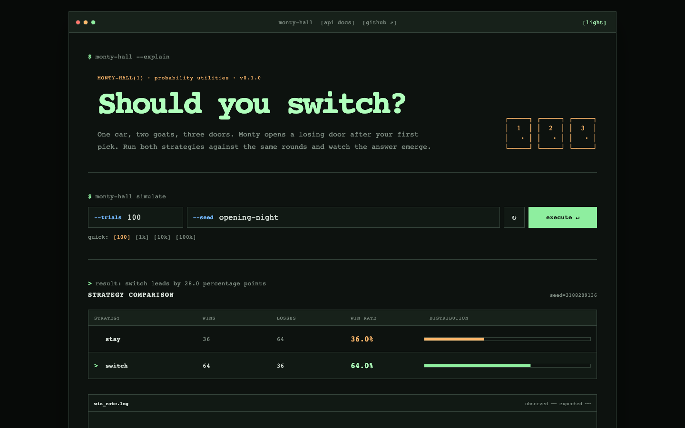

<div align="center">

# Monty Hall Lab

**One probability engine. Three interfaces. A stubbornly counter-intuitive result.**

[Live simulator](https://monty-hall-lab.monty-hall-api.workers.dev) · [API docs](https://monty-hall-lab.monty-hall-api.workers.dev/docs) · [OpenAPI contract](https://monty-hall-lab.monty-hall-api.workers.dev/api/openapi.json)


</div>

Monty Hall Lab demonstrates why switching doors wins roughly twice as often as staying. The shared TypeScript simulation engine powers a deliberately terminal-like Vue interface, a documented Hono API, and a local Node.js CLI.

## The workbench



The browser runs the engine locally—no request or cold start is needed for the interactive simulation. The API and CLI also accept optional seeds when a run needs to be reproducible.

## Why switching wins

Assume the host always opens a goat door, always offers the switch, and chooses randomly when either goat door can be opened.

Your first choice has only a one-in-three chance of being right:

$$
P(\text{win by staying}) = P(\text{first choice is the car}) = \frac{1}{3}
$$

The other two doors jointly carry the remaining two-thirds probability. Monty’s informed reveal removes a goat, not probability, so that full chance lands on the only unopened alternative:

$$
P(\text{win by switching}) = P(\text{first choice is a goat}) = \frac{2}{3}
$$

Equivalently, after choosing door 1 and seeing Monty open door 3:

$$
P(C_2 \mid H_3)
= \frac{P(H_3 \mid C_2)P(C_2)}{P(H_3 \mid C_1)P(C_1) + P(H_3 \mid C_2)P(C_2)}
= \frac{1 \cdot \frac{1}{3}}{\frac{1}{2} \cdot \frac{1}{3} + 1 \cdot \frac{1}{3}}
= \frac{2}{3}
$$

The simulation does not create the result; it makes the convergence toward $1/3$ and $2/3$ visible.

## One engine, three surfaces

```text
                      ┌─ Vue workbench (runs locally in the browser)
packages/simulation ──┼─ Hono API      (Cloudflare Worker)
                      └─ Node CLI       (terminal / scripts)
```

```text
packages/simulation  Framework-independent seeded simulation engine
apps/web             Vue 3 + Vite interface and convergence chart
apps/api             Hono API, OpenAPI contract, and Swagger UI
apps/cli             Node.js command-line interface
```

## Try it

### Web

Open the [live simulator](https://monty-hall-lab.monty-hall-api.workers.dev), choose a sample size, and run the experiment. Dark and light themes are available from the title bar.

### API

Explore requests interactively in the [public API docs](https://monty-hall-lab.monty-hall-api.workers.dev/docs), or use `curl`:

```bash
curl -X POST https://monty-hall-lab.monty-hall-api.workers.dev/api/simulate \
  -H 'Content-Type: application/json' \
  -d '{"trials":10000,"strategy":"both","seed":42}'
```

`strategy` accepts `stay`, `switch`, or `both`. Requests are capped at 1,000,000 trials. The raw contract is available at [`/api/openapi.json`](https://monty-hall-lab.monty-hall-api.workers.dev/api/openapi.json).

### CLI

```bash
pnpm simulate --trials 10000 --strategy both --seed portfolio
pnpm simulate --trials 100 --json
```

## Local development

Requires Node.js 22+ and pnpm.

```bash
pnpm install
pnpm dev
```

The Vue app runs at `http://localhost:5173`. Run the Worker separately for the API and docs:

```bash
pnpm dev:api
```

The API is at `http://localhost:8787/api`; Swagger UI is at `http://localhost:8787/docs`.

## Quality checks

```bash
pnpm test
pnpm typecheck
pnpm build
```

## Deploy

The Worker configuration serves the built Vue app as static assets and routes `/api/*` and `/docs` through Hono. After authenticating Wrangler with a Cloudflare account:

```bash
pnpm run deploy
```

That produces one free-tier-friendly Cloudflare deployment for the app, API, and documentation.
